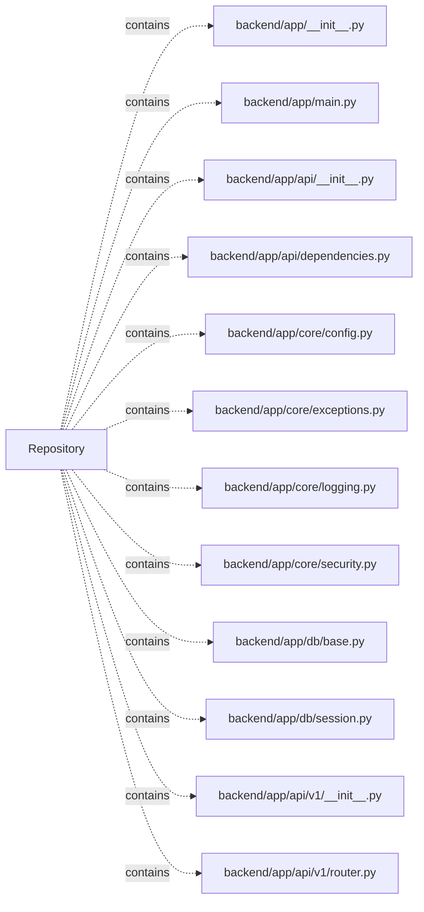

# devops-interview-platform — project architecture

[README](README.md) · [Interview questions and answers](INTERVIEW_QA.md)

## Purpose and scope

A full-stack interview preparation platform covering DevOps, cloud, Kubernetes, backend engineering, DSA, and system design.

This document describes files and symbols in this checkout. Deployment templates and statements in the original overview are distinguished from a verified running environment.

## Component diagram



For Python repositories, arrows show resolved local imports, not network calls or deployment order. Otherwise the diagram is a repository component map; containment arrows do not assert runtime integration.

## Components and responsibilities

| Component | Responsibility |
| --- | --- |
| [`backend/requirements.txt`](backend/requirements.txt) | Implementation or supporting configuration |
| [`backend/app/__init__.py`](backend/app/__init__.py) | Implementation or supporting configuration |
| [`backend/app/main.py`](backend/app/main.py) | Implementation or supporting configuration |
| [`backend/app/api/__init__.py`](backend/app/api/__init__.py) | Implementation or supporting configuration |
| [`backend/app/api/dependencies.py`](backend/app/api/dependencies.py) | Implementation or supporting configuration |
| [`backend/app/core/config.py`](backend/app/core/config.py) | Implementation or supporting configuration |
| [`backend/app/core/exceptions.py`](backend/app/core/exceptions.py) | Implementation or supporting configuration |
| [`backend/app/core/logging.py`](backend/app/core/logging.py) | Implementation or supporting configuration |
| [`backend/app/core/security.py`](backend/app/core/security.py) | Implementation or supporting configuration |
| [`backend/Dockerfile`](backend/Dockerfile) | Container build/service configuration |
| [`backend/pyproject.toml`](backend/pyproject.toml) | Implementation or supporting configuration |
| [`docker-compose.yml`](docker-compose.yml) | Container build/service configuration |
| [`frontend/Dockerfile`](frontend/Dockerfile) | User interface code/assets |
| [`README.md`](README.md) | Project explanations or operating notes |
| [`backend/README.md`](backend/README.md) | Project explanations or operating notes |
| [`docs/architecture/HLD.md`](docs/architecture/HLD.md) | Project explanations or operating notes |

## Existing design and operating guides

These checked-in guides provide the project’s detailed design, operational context, or deployment view:

- [`docs/architecture/HLD.md`](docs/architecture/HLD.md).
- [`docs/architecture/LLD.md`](docs/architecture/LLD.md).

## Setup and verification

The following commands are derived from the checked-in dependency/test contracts. Execute them from the repository root; the block prepares a local environment, not a cloud deployment.

```bash
python3 -m venv .venv
source .venv/bin/activate
python -m pip install -r backend/requirements.txt
```

Python dependencies: [`backend/requirements.txt`](backend/requirements.txt).

No dedicated test files were found in the inspected first-party file inventory. A future implementation should add executable acceptance checks.

## Operating boundaries and design review

Before turning this checkout into a customer deployment, establish the input contract, data ownership, access controls, failure response, evaluation criteria, and rollback owner. Repository fixtures and unit tests demonstrate local behavior; they do not establish throughput, uptime, compliance, or business impact.

A useful architecture review starts with the linked implementation: identify where input enters, where a decision is made, which state can change, and which external dependency can fail. Add a deployment view only for infrastructure that is actually configured and exercised.
